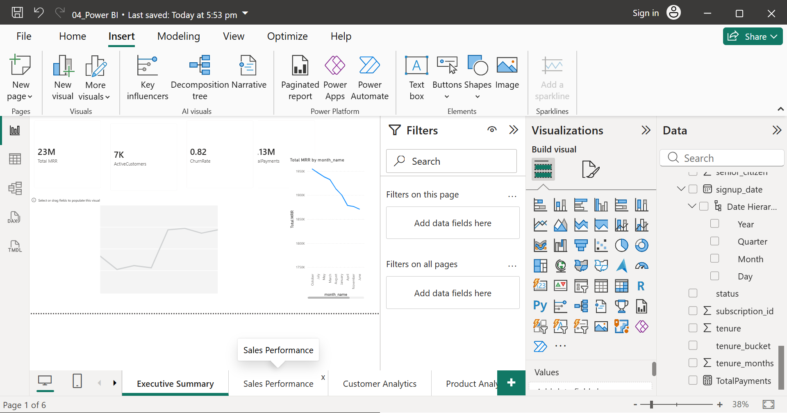

# NexaFlow SaaS Analytics Dashboard

  

## Business Problem
NexaFlow Inc. faced increasing churn and declining MRR. This project delivers a full end-to-end analytics solution identifying churn drivers, revenue trends, and customer segments across 299,872 records.

## Key Business Insights
| Insight | Finding |
|---|---|
| Churn Risk | Month-to-month customers churn 3x more |
| Revenue | Enterprise plan drives highest MRR |
| LTV | Two-year contracts = 63% higher LTV |
| Payments | 5% failed payment rate = recoverable loss |

## Tech Stack
| Tool | Purpose |
|---|---|
| Python (Pandas, Seaborn) | EDA & Cleaning |
| SQL (SQLite) | Star Schema & KPI Queries |
| Power BI + DAX | 6-Page Dashboard |

## Dashboard Preview

## Dataset
- Source: Kaggle Telco Churn (expanded)
- 299,872 rows across 6 tables

## Author
**Gracy Sivaji** | MCA | Data Analyst
